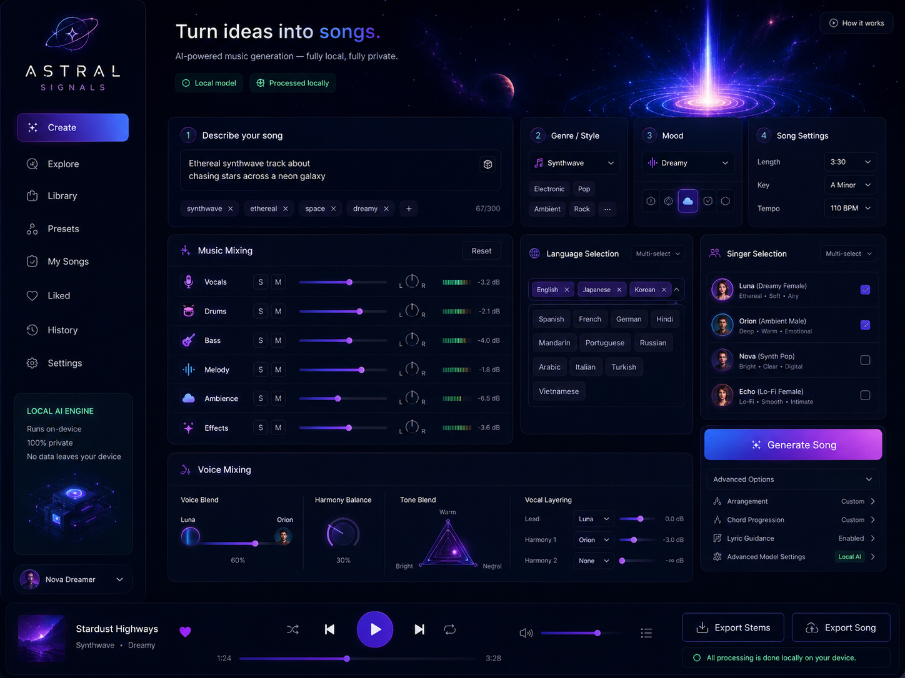

# Astral Signals

Astral Signals is a local-first "idea to full song" studio for Windows. It lets you stay lightweight in `Quickstart` or go deep in `Studio` with multilingual lyrics, singer routing, cloned voice previews, stem workflows, and Alice-driven orchestration.

[](https://www.python.org/)
[](https://www.microsoft.com/windows)
[](https://github.com/Alice-Initiative/astral-signals)
[](LICENSE)



## What Astral is for

- Turn a short idea into a full custom song without leaving your machine
- Let Alice the AI compose, arrange, and tune songs with as little or as much supervision as you want
- Lock one singer across multiple languages, or deliberately swap singers by language or section
- Preview voices before a full render
- Split vocals and instrumentals, remix stems, and match lyrics to arrangement timing
- Compare multiple render engines from one mapped prompt

Heavy assets default to `S:\AstralSignals`, so large model downloads and audio outputs stay off your system drive unless you override them.

## Current stack

| Role | Engine | Status |
| --- | --- | --- |
| Composer | Ollama | Ready |
| Main sung-song engine | ACE-Step 1.5 | Ready |
| Fast sketch engine | MusicGen | Ready |
| Stem-native alternate engine | SongGeneration / LeVo 2 | Experimental, locally verified with `songgeneration_v2_large` |
| Alternate lyric-song engine | HeartMuLa OSS 3B | Experimental, locally verified |
| Cloned speech / voice preview | Voicebox | Ready |

## Main features

- `Quickstart` mode for fast prompt-to-song flow
- `Studio` mode for lyrics, Alice orchestration, singer routing, clone tools, and stem work
- `Alice Lab` for hook direction, chord story, dynamic arc, orchestration, and transition planning
- `Voice Booth` to audition a singer before a full song render
- `Voice Clone Studio` for cloned speech profiles and low-strength singer anchoring
- `Stem Studio` for split, remix, and lyric timing workflows
- `Engine Lab` that surfaces installed backends and optional local music tools
- `Compare Engines` to render the same mapped concept through multiple backends side by side

## Local model options

Astral reads installed local models dynamically.

- Composer models come from your live Ollama catalog
- Song engines come from the Astral backend catalog
- Optional labs are discovered from vendored repos on disk

On this machine, Astral is currently set up for:

- `qwen3:4b`
- `qwen3.5:9b`
- `qwen3-vl:8b`
- `ACE-Step`
- `MusicGen Small`
- `MusicGen Medium`
- `SongGeneration v2 Large`
- `SongGeneration Base New`
- `HeartMuLa OSS 3B`

## Quick start

### 1. Install Python dependencies

```powershell
python -m pip install -e .
```

### 2. Point Astral at your preferred storage root if needed

The default is already `S:\AstralSignals`. If you want a different root:

```powershell
$env:ASTRAL_SIGNALS_HOME = "S:\AstralSignals"
```

### 3. Launch the app

```powershell
.\launch_astral_signals.ps1
```

Then open [http://127.0.0.1:7860](http://127.0.0.1:7860).

## Backend bootstrap

### Core optional repo sync

```powershell
.\bootstrap_optional_engines.ps1
```

### SongGeneration / LeVo 2

```powershell
.\bootstrap_songgeneration_backend.ps1
```

### HeartMuLa

```powershell
.\bootstrap_heartmula_backend.ps1
```

## Suggested user flow

### Quickstart

1. Pick a preset or write the core brief
2. Choose language, genre, mood, and duration
3. Hit `Compose Song` if you want help with lyrics and structure
4. Hit `Generate Song`
5. Use `Compare Engines` when you want a fast side-by-side pass

### Studio

1. Tune manual lyrics, orchestration, and Alice autonomy
2. Set singer routing and multilingual behavior
3. Preview voices and cloned speech cues
4. Render the song
5. Split stems, remix, and align lyrics if needed

## Repo structure

```text
astral_signals/                  App code
astral_signals/static/           Web UI
bootstrap_optional_engines.ps1   Optional repo/vendor sync
bootstrap_songgeneration_backend.ps1
bootstrap_heartmula_backend.ps1
launch_astral_signals.ps1        Local launcher
docs/astral-signals-ui.png       Repo screenshot
docs/discord-forum-post.md       Ready-to-share forum draft
```

## Distribution notes

- The repo is public and intended for local usage first
- The launcher and defaults are tuned for Windows + NVIDIA CUDA
- Large backends and model weights live outside the repo by design
- The code is MIT-licensed, but upstream repos, model weights, and checkpoints keep their own licenses and usage terms

If you plan to use specific engines or weights commercially, verify the upstream license and model card for that backend before shipping output.

## Contributing

See [CONTRIBUTING.md](CONTRIBUTING.md).

## Sharing

A ready-to-post Discord forum draft is included at [docs/discord-forum-post.md](docs/discord-forum-post.md).

## License

This repository's code is released under the [MIT License](LICENSE).
